# EL — A tribute to Edmond Locard

<p align="center">
  
  <br>
  <sub><em>AI-generated image.</em></sub>
</p>

A multi-agent DFIR orchestrator for the SANS SIFT Workstation, built for
the [SANS Find Evil 2026](https://findevil.devpost.com/) competition and
designed as a reusable forensic investigation framework.

📺 **Watch the 4:45 demo walkthrough:** [EL demo (YouTube)](https://youtu.be/QuliIYfjqrI) — a live-terminal screencast with narration that installs EL, runs a real forensic investigation end-to-end, hits an on-screen **self-correction ("Bug found & fixed") at [2:07](https://youtu.be/QuliIYfjqrI?t=127)**, then shows the case + executive reports. Full [chapter index & content guide](docs/demo_video.md); the same self-correction loops (insufficient-finding → code fix → test-lock) are documented in [`sample-reports/SRL-2018-shakedown.md`](sample-reports/SRL-2018-shakedown.md) and [§ Self-correction](#self-correction).

**Judges:** start at [`docs/JUDGES.md`](docs/JUDGES.md) — single-page
quickstart with a 5-min contract verification, a 30-min end-to-end run
against the public M57-Jean scenario, and a reference table mapping the
six judging criteria to specific files and commands.

> **"Every contact leaves a trace."** — [Edmond Locard](https://numerabilis.u-paris.fr/ressources/pdf/sfhm/hsm/HSMx2007x041x003/HSMx2007x041x003x0269.pdf), 1910
>
> EL takes Locard's exchange principle as its data model. Every artifact is
> a trace; every trace has a contact (entity) on each end. The per-case
> Kùzu graph is the materialised contact substrate over which specialist
> agents reason.

---

## What it does

Hand EL a piece of evidence — memory image, pcap, EVTX file, CloudTrail
JSON, Azure sign-in / M365 UAL export, extracted-artifacts directory,
Velociraptor / UAC / dfTimewolf collection bundle, Falco event JSONL,
E01 disk image (NTFS / ext4 / APFS), live Linux system root, or extracted
filesystem tree (Windows / Linux / macOS / Android / iOS) — and it produces:

- **A structured Findings ledger** — every claim ships with the tool, version,
  command, output sha256, supporting/refuting hypotheses, and an
  adversarial-review verdict. No claim without evidence.
- **A ranked hypothesis table** — Heuer's *Analysis of Competing
  Hypotheses* over 33 case-level hypotheses (ransomware, APT espionage,
  insider exfil, BEC, supply chain, brute force, cloud persistence, C2
  beaconing, opportunistic commodity, process injection, credential
  access, lateral movement, persistence variants, mobile-spyware
  persistence, container escape, K8s privilege escalation, plus a null
  benign-no-incident).
- **A Markdown report** with executive summary, hypothesis ranking, most
  diagnostic findings, MITRE ATT&CK techniques implicated, IOC catalog,
  and a per-finding disconfirming-evidence checklist.
- **A self-contained HTML case view** (`el report --html`) — single-file
  dark-theme dashboard with ACH ranking, filterable findings grid,
  detail drawer, SVG attack-chain graph pulled from the Kùzu substrate,
  ATT&CK coverage heatmap grouped by tactic, and Diamond Model
  projection. Zero CDN, works from `file://`; `--watch` mode re-renders
  live as agents emit findings.
- **A built-in HTTP viewer** (`el serve`) — local loopback web server
  on `http://127.0.0.1:8089/` that browses every case under
  `/opt/EL/cases/`. Snap-confined browsers (default Chromium on
  Ubuntu) cannot read `/opt/` via `file://`; this is the supported
  workaround. Optional systemd `--user` service install
  (`el serve --install-service` or `./install.sh --with-serve`) for
  auto-start at login.
- **A STIX 2.1 bundle** + **machine-readable findings.json** + **per-case
  Kùzu graph** + **forensic_audit.log** + **per-case CLAUDE.md** for
  follow-on interactive analysis.

The contract is hard: EL refuses to advance to synthesis while any finding
remains `red_review.status == "unresolved"`, and `confidence="insufficient"`
is a first-class output. **An honest "I don't know" beats a confident
guess.**

---

## Architecture

> Rendered inline below (GitHub renders Mermaid natively). A standalone
> export for slides / the submission form is at
> [`docs/architecture.png`](docs/architecture.png) — evidence sources →
> intake/triage → 34 specialist agents (each wrapping vetted SIFT CLI
> tools) → shared per-case substrate → correlate / ACH / adversarial
> review → judge-facing output pipeline, plus the **Claude Code session**
> layer (Playwright MCP server from `.mcp.json` + the `el-red-review` /
> `el-ai-brief` deferred-LLM fulfilment skills).

> **Pattern: Multi-Agent Framework** (Python coordinator over 34 specialist
> agents) **with Claude Code session integration** (Playwright MCP server +
> `el-red-review` / `el-ai-brief` deferred-LLM skills).

```mermaid
flowchart TB
    %% ============ ARCHITECTURAL TRUST BOUNDARIES (dashed boxes) ============
    %% Crossing a dashed border = crossing a trust boundary.
    %% These are ARCHITECTURAL guardrails enforced in code (intake strips
    %% write-bits; ACH is pure Python; the LLM never scores/writes/blocks),
    %% NOT prompt-text guardrails.

    subgraph LEGEND["◆ LEGEND — architecture pattern &amp; guardrail types &nbsp;(dashed box = trust boundary)"]
        direction TB
        L_PAT["<b>PATTERN: Multi-Agent Framework</b><br/>Python coordinator over 34 specialist agents<br/>+ Claude Code session integration (Playwright MCP + skills)"]
        L_EVID["<b>Evidence zone</b> — ARCHITECTURAL guardrail<br/>strict read-only; write-bits stripped at intake"]
        L_DET["<b>Deterministic zone</b> — ARCHITECTURAL guardrails<br/>court-vetted CLI tools · pure-Python ACH · schema rejects evidence-less findings"]
        L_LLM["<b>Advisory LLM zone</b> — the ONLY PROMPT-BASED guardrails<br/>(Red Reviewer / executive-brief prompt text); never scores, writes, or blocks"]
        L_PAT ~~~ L_EVID ~~~ L_DET ~~~ L_LLM
    end

    subgraph ZONE_EVID["🔒 TRUST BOUNDARY · Evidence zone<br/>STRICT READ-ONLY — chain of custody<br/>(write-bits stripped at intake; originals never modified)"]
        direction TB
        subgraph INPUTS["Evidence inputs (16 validated shapes, 27 routed kinds)"]
            direction LR
            IN_MEM["memory image<br/>(.raw / .vmem / .mdd)"]
            IN_DISK["disk image<br/>E01 / raw / NTFS / ext4 / APFS<br/>+ VHDX / VMDK"]
            IN_PCAP["pcap / pcapng<br/>(also pcap-collection)"]
            IN_LOG["EVTX / .evt /<br/>CloudTrail / Entra / M365 /<br/>k8s-audit / Falco events"]
            IN_FS["FS tree<br/>Windows / Linux / macOS /<br/>Android / iOS / QNAP"]
            IN_VELO["Velociraptor bundle<br/>+ UAC collection<br/>+ dfTimewolf bundle"]
            IN_LIVE["<i>live Linux system</i><br/>UAC + Tracee eBPF"]
        end
        INTAKE["<b>Intake</b><br/>hash + manifest<br/>read-only enforcement"]
        INPUTS --> INTAKE
    end

    subgraph ZONE_DET["TRUST BOUNDARY · Deterministic pipeline<br/>court-vetted CLI tools · Pydantic-validated findings<br/>NO LLM in the scoring path"]
        direction TB
        TRIAGE["<b>Triage</b><br/>magic bytes + directory shape<br/>sets evidence_kind"]
        COORD{"<b>Coordinator</b><br/><a href='docs/state-machine.md'>state machine</a><br/>intake → triage → hypothesis_gen →<br/>parallel_investigate → correlate →<br/>adversarial_review → synthesize → report → done"}
        TRIAGE --> COORD

        subgraph AGENTS["34 specialist agents (one per evidence kind, chained as applicable)"]
            direction TB
            A_MEM["MemoryForensicator<br/>18 vol3 plugins + Baseliner<br/>+ MemProcFS FindEvil corroboration"]
            A_USR["<b>UserActivityAgent</b><br/>Office MRU FILETIMEs + TypedPaths<br/>+ drive-letter↔USB map<br/>+ removable-staging detector"]
            A_RDP["<b>RDPBruteForceAnalyst</b><br/>inbound :3389 from external IPs<br/>brute-force cluster + breach"]
            A_DISK["DiskForensicator<br/>Sleuth Kit + EWF + NTFS/ext4/APFS mount"]
            A_WIN["WindowsArtifactAgent<br/>11 EZ Tools + BAM/DAM + IE5 + XP .evt"]
            A_LIN["LinuxForensicator<br/>utmp/wtmp/btmp + systemd-journal +<br/>cron + SSH + Father rootkit + UAC mode"]
            A_MAC["MacOSForensicator<br/>+ Mandiant macos-UnifiedLogs (Rust)"]
            A_AND["AndroidForensicator<br/>+ MVT (Pegasus / Predator IOCs)"]
            A_IOS["IOSForensicator<br/>+ MVT mercenary-spyware check"]
            A_NET["NetworkAnalyst<br/>scapy + Zeek + Suricata + tshark<br/>+ JA3/JA4+ + RITA-algorithm beaconing"]
            A_LOG["LogAnalyst<br/>EvtxECmd + Hayabusa + Sigma correlation"]
            A_CRED["CredentialAnalyst"]
            A_LAT["LateralMovementAnalyst"]
            A_PS["PowerShellAnalyst<br/>EID 4104 + 4103 + PSReadline"]
            A_CLOUD["CloudForensicator<br/>CloudTrail / VPC / Entra / M365 / GCP"]
            A_MAIL["EmailForensicator<br/>PST + OST + inbound phishing"]
            A_BROWSE["BrowserForensicator<br/>+ Hindsight (Chromium family)"]
            A_EXEC["ExecutionCorroborator"]
            A_ENDP["EndpointAnalyst<br/>Velociraptor v0.7+ schema<br/>(PEDump / ProcessInfo / MFT / Linux)"]
            A_TIME["TimelineSynthesist<br/>Plaso → Timesketch push"]
            A_HUNT["ThreatHunter<br/>YARA / YARA-X auto-prefer + stego-carrier"]
            A_MAL["MalwareTriage<br/>capa + FLOSS + pefile + 21 families"]
            A_LOGC["<b>LogCorpus</b><br/>multi-host SOC logs → per-format parsers<br/>(Win Event XML / eCAR / Zeek JSON / ASA / Snort / syslog)"]
            A_LIVE["<b>LiveResponseCollector</b><br/>UAC IR-triage + Tracee eBPF"]
            A_DFTW["<b>DFTimewolfDispatcher</b><br/>recipe + sub-artifact inventory"]
            A_K8S["K8sAuditAnalyst"]
            A_CONT["<b>ContainerForensicator</b><br/>Falco events → escape / k8s privesc"]
        end
        COORD --> AGENTS

        subgraph SHARED["Shared per-case substrate"]
            direction LR
            LEDGER[("findings.sqlite<br/>(Pydantic-validated)")]
            GRAPH[("graph.kuzu<br/>Locard entities + edges")]
            KNOW[("~/.el/knowledge.sqlite<br/>(cross-case IOC + imphash)")]
        end
        AGENTS --> LEDGER
        AGENTS --> GRAPH
        AGENTS -. ioc registration .-> KNOW

        CORR["<b>Correlator</b><br/>cross-agent Kùzu graph queries"]
        ACH["<b>ACH Engine</b><br/>33 hypotheses × all findings<br/>Heuer diagnostic scoring<br/><i>(pure Python — no LLM)</i>"]
        RED["<b>Red Reviewer</b><br/>rule-based challenger (always, deterministic)<br/>+ LLM augmentation (advisory only)<br/>blocks SYNTHESIZE until every unresolved Finding resolves"]
        LEDGER --> CORR --> ACH --> RED
        RED -- "any unresolved?" --> COORD

        REPORT["<b>Reporter</b><br/>deterministic projection of Findings"]
        RED --> REPORT

        subgraph OUT["Judge-facing outputs (sealed at DONE)"]
            direction LR
            O_MD["report.md<br/>narrative.md"]
            O_HTML["case.html<br/>(dark theme, zero CDN)"]
            O_STIX["stix-bundle.json<br/><i>(deterministic UUID5 ids,<br/>Layer-3 recurrence labels)</i>"]
            O_JSON["findings.json"]
            O_SIGMA["reports/sigma_rules/<br/>SPL · KQL · Lucene packs"]
            O_EXEC["execution_log.jsonl<br/>execution_log.md<br/><b>traceability_matrix.md</b>"]
            O_SEAL["seal.json<br/>+ tar.gz archive"]
        end
        REPORT --> OUT

        SERVE["<b>el serve</b><br/>loopback HTTP viewer :8089"]
        O_HTML --> SERVE
    end

    INTAKE --> TRIAGE

    subgraph ZONE_LLM["TRUST BOUNDARY · Advisory LLM zone<br/>Claude Code session skills (no API key needed)<br/>NEVER scores ACH · NEVER writes evidence · NEVER blocks"]
        direction TB
        MCP["<b>Playwright MCP server</b><br/>(.mcp.json → npx @playwright/mcp)<br/>browser automation over the web view"]
        SKILL_RR["skill: <b>el-red-review</b><br/>fulfils deferred adversarial challenger"]
        SKILL_AI["skill: <b>el-ai-brief</b><br/>fulfils deferred executive brief"]
    end

    subgraph PUSH["External push targets (opt-in, env-var configured)<br/>outside all trust boundaries"]
        direction LR
        P_TS["Timesketch<br/>(.plaso upload)"]
        P_OCTI["OpenCTI<br/>(STIX bundle)"]
        P_MISP["MISP<br/>(STIX bundle)"]
        P_CAPE["CAPE Sandbox<br/>(dynamic analysis)"]
    end

    REPORT -. opt-in .-> PUSH
    SERVE <-. drive / screenshot .-> MCP
    RED -. "deferred when inside Claude Code<br/>(CLAUDECODE=1, no API key)" .-> SKILL_RR
    REPORT -. "deferred when inside Claude Code" .-> SKILL_AI
    SKILL_RR -. verdicts merge .-> LEDGER
    SKILL_AI -. brief re-renders .-> REPORT

    classDef sub fill:#0d1117,stroke:#30363d,color:#c9d1d9
    classDef zoneEvid fill:#1c1408,stroke:#d29922,stroke-width:3px,stroke-dasharray:6 4,color:#e3b341
    classDef zoneDet fill:#0a1410,stroke:#3fb950,stroke-width:3px,stroke-dasharray:6 4,color:#7ee787
    classDef zoneLLM fill:#160e1f,stroke:#bc8cff,stroke-width:3px,stroke-dasharray:6 4,color:#d2a8ff
    classDef zoneExt fill:#161313,stroke:#8b949e,stroke-width:2px,stroke-dasharray:4 4,color:#8b949e
    classDef legendPat fill:#0d1117,stroke:#58a6ff,stroke-width:2px,color:#79c0ff
    class INPUTS,AGENTS,SHARED,OUT,LEGEND sub
    class ZONE_EVID zoneEvid
    class ZONE_DET zoneDet
    class ZONE_LLM zoneLLM
    class PUSH zoneExt
    class L_PAT legendPat
    class L_EVID zoneEvid
    class L_DET zoneDet
    class L_LLM zoneLLM
```



> **Guardrail legend — architectural vs prompt-based.** The dashed zones above
> are **architectural** guardrails, enforced in code regardless of any prompt:
> evidence stays read-only (intake strips write-bits on `/cases`, `/mnt`,
> `/media`, `/evidence`), ACH scoring is pure Python, the Finding schema rejects
> any non-`insufficient` finding with empty `evidence[]`, and the advisory LLM
> zone can never score, write evidence, or block — its output only re-enters via
> the validated ledger merge. The only **prompt-based** guardrails are the
> *contents* of the Red Reviewer's LLM challenger prompt and the executive-brief
> prompt (the advisory zone); even there the *architecture* (deferred-skill
> boundary, schema validation on merge) is what makes them non-load-bearing.

### Agents

| Agent | Owns |
|---|---|
| `Triage` | First-touch: hash, file-magic, evidence-kind classification, vol3 banner OS detection, directory-shape recognition (Windows-artifacts / Velociraptor / Android / iOS / macOS — mobile shapes detected by cheap `is_dir()` probes before the expensive filesystem walk) |
| `MemoryForensicator` | Volatility 3 plugins (`pslist`, `psscan`, `pstree`, `cmdline`, `malfind --dump`, `netstat`, `netscan`, `dlllist`, `svcscan`, `modules`, `modscan`, `ldrmodules`, `handles`, `getsids`, `ssdt`, `driverirp`, `filescan`, `mftscan`); psscan-pslist hidden-process diff; modules-vs-modscan unlinked-driver diff; ldrmodules three-list reflective-injection diff; PE-header / process-anomaly detection; credential-access carve-out (lsass / winlogon / csrss); optional Memory Baseliner image-vs-image diff; **MemProcFS FindEvil corroboration** (mounts the image as a virtual FS, runs Ulf Frisk's built-in injection scanner — independent second tool satisfies Red Reviewer's single-tool challenger automatically; FUSE harvest is watchdog-bounded so a stalled mount degrades gracefully instead of hanging); **cloud/CDN-aware netscan beacon scoring** (benign Microsoft/Azure/Akamai/Google/AWS/Cloudflare/Fastly/Dropbox CIDRs + weak web-port residue downgraded below `H_C2_BEACONING`, RITA-style interval analysis flagged for escalation); raw `ntoskrnl` banner fallback for truncated/over-4GB acquisitions (routes to carve-only + emits a precise `insufficient` finding rather than a false negative) |
| `UserActivityAgent` | Chains after MemoryForensicator on Windows. Reconstructs the per-user project-access timeline from in-memory NTUSER hives — Office MRU FILETIME decoder (`[F…][T<filetime>][O…]*path` REG_SZ values), TypedPaths (Explorer address-bar history), MountedDevices ASCII-column → drive-letter↔USB-serial map. **Removable-staging detector** flags Office-MRU paths that resolve to a USB drive letter AND contain corporate-project fragments — emits findings tagged `H_INSIDER_DATA_STAGING` + `H_INSIDER_DATA_EXFIL` (proves intentional collection, not accidental sync) |
| `RDPBruteForceAnalyst` | Chains after UserActivityAgent on Windows. Walks the netscan JSONL the memory forensicator already produced; clusters inbound TCP/3389 connections per external (non-RFC1918) source IP with CLOSED / SYN_RCVD / ESTABLISHED breakdown. ≥10 connections per source = brute-force cluster (`H_BRUTE_FORCE`); ESTABLISHED > 0 = breach (separate Finding so attempted vs. authenticated edges are visible at a glance). Disjoint from `LateralMovementAnalyst` which scores RFC1918↔RFC1918 RDP |
| `DiskForensicator` | Sleuth Kit (`mmls`, `fls`, `mactime`); EWF integrity verification + `ewfmount` + per-partition (and no-partition fallback) walk; NTFS mount + artifact extraction; ext4 mount; APFS mount via `fsapfsmount`; disk anomaly scoring (PsExec service binary, PyInstaller `_MEI` temp dirs, svchost/lsass outside System32, exe-in-Temp, non-MS scheduled tasks, mimikatz-named binaries, vssadmin shadow-copy deletion traces); **encrypted-artifact surfacing** (BitLocker recovery-key `.txt`, aescrypt `.aes`, PGP/GnuPG key material `pubring.kbx`/`secring.gpg`/`private-keys-v1.d`/`.asc`/`.gpg`/`.pgp`, VeraCrypt/TrueCrypt `.tc`/`.hc` containers → advisory `H_DISK_ENCRYPTED`; surfacing only — decryption is out-of-scope by design) |
| `WindowsArtifactAgent` | Extracted-artifacts directory pipeline — auto-chained after DiskForensicator extracts: MFTECmd, RECmd-Kroll-batch, AmcacheParser, AppCompatCacheParser, PECmd, EvtxECmd, SrumECmd, SBECmd, JLECmd, LECmd, RBCmd, BAM/DAM registry subtree decoding, ActivitiesCache.db (Windows Timeline) parsing |
| `LinuxForensicator` | Extracted Linux filesystem tree (ext4 mount or pre-extracted) — pulls `/etc`, `/var/log`, `/var/spool/cron`, per-user histories + SSH. 5 detectors: shell-history malicious (reverse shell / download cradle / base64 pipe / persistence / defense evasion / priv esc / credential access), `/etc/ld.so.preload`, auth-log failure burst, `authorized_keys` anomaly, cron suspicious. **Father-rootkit detection** (multi-directory LD_PRELOAD + magic GID + backdoor-port pattern matcher). Also accepts **UAC collection** evidence shape with the same detectors |
| `MacOSForensicator` | Extracted macOS filesystem (APFS mount or pre-extracted). Pulls `/private/etc`, `/Library/Launch{Agents,Daemons,StartupItems}`, per-user Safari/KnowledgeC/Quarantine/LoginItems/LaunchAgents, `/private/var/log`. 4 detectors: LaunchAgent/Daemon suspicious-path persistence, shell-history malicious (shared Linux pattern library), Safari `QuarantineEventsV2` raw-IP / suspicious-TLD download source, Safari `Downloads.plist` anomalies. **Mandiant macos-UnifiedLogs** (Rust tracev3 parser, ~100x faster than `log show`, runs on Linux): walks `.logarchive` bundles + `/private/var/db/diagnostics/Persist/` for high-signal events (TCC consent / AMFI rejection / Gatekeeper / Sandbox violations / kextd) |
| `AndroidForensicator` | Pre-extracted Android filesystem tree (Belkasoft / UFED / adb-pull). Pulls `/data/system/*.xml+db`, `/data/adb/`, `/data/local/tmp/`, ANR traces, tombstones, per-app messenger DBs. 4 detectors: rooted device (Magisk markers), sideloaded APKs (packages.xml installer heuristic with OEM exemptions), `/data/local/tmp` executable staging, messenger presence. **MVT** (Amnesty Tech Mobile Verification Toolkit): runs `check-androidqf` / `check-backup` against the artifact set with the published Pegasus / Predator / Triangulation STIX2 IOC bundles → activates the otherwise-dormant `H_MOBILE_SPYWARE_PERSISTENCE` scorer |
| `IOSForensicator` | Pre-extracted iOS filesystem tree (checkm8 / GrayKey / Cellebrite). Pulls SystemVersion.plist, `/private/var/mobile/Library/` user-data DBs (SMS, AddressBook, CallHistory, knowledgeC, interactionC, Safari, Mail, Notes, Health), per-app iTunesMetadata + BundleMetadata + Info.plist, provisioning profiles. 4 detectors: jailbreak indicators, sideloaded apps (no iTunesMetadata + non-Apple bundle id), provisioning-profile presence, messenger / privacy-tool presence (Signal / Telegram / Wickr / Session / Threema / Onion Browser / KeepSafe / Burner / ProtonMail / Tutanota / …). **MVT** `check-fs --fast` + `check-backup -n` runs after iLEAPP for mercenary-spyware IOC matching against Amnesty Tech bundles |
| `NetworkAnalyst` | pcap parsing via scapy: flows, DNS, HTTP Hosts + URIs + User-Agents, TLS SNI, suspicious-port flagging, Zeek replay with DGA entropy + DNS tunneling + SMB admin-share write detection, wire-layer Kerberos triage, JA3 reputation. **JA4+ family** (FoxIO ja4.py — TLS / HTTP / SSH / QUIC client fingerprinting; supplements not replaces JA3). **Statistical beaconing detection** (RITA-algorithm Hill & Bestard formula on Zeek conn.log: ≥0.85 score on `ts_score`+`disp_score`/2 = high-confidence `H_C2_BEACONING` lift) |
| `LogAnalyst` | EvtxECmd → high-value Event ID extraction (4624, 4625, 4672, 4688, 4697, 4698, 4720, 4732, 4769, 4776, 1102, 7045); SIGMA rule evaluator. **Hayabusa Sigma correlation** (v3+ composite-rule output → second high-confidence finding when correlation rules fire — e.g. brute-force = "N failed + 1 success in 1 min") |
| `CloudForensicator` | AWS CloudTrail JSON + AWS VPC Flow Logs + Azure Entra sign-in logs + M365 Unified Audit Log + Azure Activity + GCP Cloud Audit. Sniffs input shape and dispatches; detectors for brute / spray, legacy-auth bypass, impossible travel, OAuth consent, inbox-rule external forwarding |
| `EndpointAnalyst` | Velociraptor collection bundles. v0.6 era: Pslist / Netstat / Autoruns / Prefetch / TaskScheduler. **v0.7+ schema**: Generic.System.PEDump, Windows.Memory.ProcessInfo, Windows.NTFS.MFT, Windows.Forensics.{Amcache, Lnk, Jumplists, Shellbags, UserAssist}, Linux.Sys.Pslist / Linux.Network.Netstat / Linux.Forensics.BashHistory |
| `BrowserForensicator` | Chrome / Edge / Firefox history, cookies, login-data, downloads from extracted user profiles. **Hindsight** (Ryan Benson) for Chromium-family deep parsing: Local Storage, IndexedDB, Session Storage, autofill, login data, sync evidence, extensions, FedCM. Emits exfil-shape findings on forum-upload paths / anon-share hosts / consumer-webmail |
| `CredentialAnalyst` | Kerberos anomalies from EVTX — RC4-HMAC TGS-REQ (Kerberoasting), AS-REQ failure burst, krbtgt-service TGS-REQ (golden-ticket smell) |
| `PowerShellAnalyst` | EID 4104 ScriptBlock decoding (base64 + gzip) + malicious pattern match, EID 4103 module logging, PSReadline history, transcription logs |
| `SigmaAnalyst` | Native SIGMA rule evaluator over parsed EVTX — EventID-indexed pre-filter, 90%-coverage modifier set, tag-to-hypothesis mapping |
| `EmailForensicator` | `.pst` / `.ost` / `.msg` / `.eml` parsing via `libpff` + `libolecf` wrappers |
| `ExecutionCorroborator` | Cross-artifact execution confirmation — Prefetch × Amcache × Registry × EvidenceOfExecution overlap |
| `LateralMovementAnalyst` | Cross-host pivot detection from EVTX 4624/4625/4648/4672/4769 + Security-Auditing event chaining |
| `TimelineSynthesist` | Plaso `log2timeline.py --parsers win_gen --hashers md5,sha256 --timezone UTC` + `psort.py` + `pinfo.py` (opt-in via `--timeline`). **Timesketch push** (opt-in via `EL_TIMESKETCH_URL` + token) — auto-uploads the `.plaso` storage to a configured Timesketch sketch at `case_id` for collaborative review |
| `Correlator` | Kùzu graph queries — top destination IPs, cross-host shared processes, entity counts, netscan-triage cluster lifting |
| `ThreatHunter` | Auto-generates a per-case YARA file from extracted IOCs; sweeps the input + analysis dir; uses `el hunt <case>` CLI for standalone re-sweeps |
| `MalwareTriage` | Per-region `.dmp` strings extraction + 19-family fingerprint library (mimikatz / cobalt strike / metasploit / empire / darkcomet / njrat / remcos / agent tesla / hancitor / trickbot / qakbot / icedid / sliver / ip_lookup_chain / angler / nuclear / fiesta EKs / asprox / dyre). Also scans non-memory analysis text (pcap summaries, EVTX CSVs, fls bodyfiles) for the same fingerprints; `capa` + `FLOSS` integration with ATT&CK technique attribution on dumped PEs / shellcode |
| `RedReviewer` | Rule-Based Challenger always runs (Office-spawn-shell, JIT carve-out for credential targets, LOLBin, network-context, low-confidence corroboration, single-evidence); LLM challenger augments when `ANTHROPIC_API_KEY` is set |
| `LiveResponseCollector` | Triage-routed for `live-linux-system` evidence kind (input is `/` or a chroot with active `/proc`). Runs UAC IR-triage profile + Tracee eBPF time-bounded capture (`EL_TRACEE_DURATION` env, 5–600s default 60). Stages results so downstream `LinuxForensicator` UAC mode picks them up |
| `DFTimewolfDispatcher` | Triage-routed for `dftimewolf-bundle` (recipe JSON/YAML + `dftimewolf.log` alongside artifacts). Records *provenance* (which dfTimewolf recipe + modules ran — chain-of-custody value) and emits a per-kind sub-artifact inventory with operator follow-up commands; sub-artifacts (Plaso storage, CloudTrail JSON, .pcap, .evtx) re-route through existing EL agents on operator re-run |
| `ContainerForensicator` | Triage-routed for `falco-events` (Falco JSONL with `rule` + `priority`). Aggregates by rule + priority; classifies hits into container-escape / K8s-privesc buckets via curated rule-name keyword families; emits `H_CONTAINER_ESCAPE` / `H_K8S_PRIVILEGE_ESCALATION` findings + per-event medium-confidence detail for top CRITICAL/ERROR events |
| `K8sAuditAnalyst` | Kubernetes audit-log JSON parser (audit.k8s.io/v1) — surfaces RBAC abuse, ServiceAccount token operations, privileged-pod admission, exec/portforward into privileged pods |

Plus the **ACH engine** (Heuer-style scoring; not a Claude agent — pure Python) which
emits a ranked-hypothesis Finding and writes a per-case `ach_matrix.json`.

### Skills

Tool wrappers, shared by agents, hardened against the operator-tier gotchas
documented in
[Protocol SIFT](https://github.com/teamdfir/protocol-sift)'s
five `SKILL.md` files (memory-analysis, sleuthkit, plaso-timeline,
windows-artifacts, yara-hunting).

| Skill | Wraps |
|---|---|
| `vol3` | Volatility 3 plugins; `--offline` opt-in to skip symbol-download hangs; `--dump` integration; 18 plugins wired |
| `sleuthkit` | `mmls`, `fls`, `mactime` (`-z UTC` default), `ewfinfo`, `ewfverify`, `ewfmount -X allow_other`, `img_stat`, `fsstat`, `tsk_recover`, `mount_ntfs` / `mount_linux_ro` / `mount_apfs_ro`, `extract_windows_artifacts` |
| `ezt` | EZ Tools via `dotnet`: EvtxECmd (`--maps` default), MFTECmd (`--at` default), RECmd (`--bn Kroll_Batch.reb` default), AmcacheParser, AppCompatCacheParser, PECmd, SBECmd, JLECmd, LECmd, SrumECmd, RBCmd |
| `plaso` | `log2timeline.py` with SKILL defaults (`--parsers win10 --hashers md5,sha256 --timezone UTC`), `psort.py`, `pinfo.py` |
| `scapy_pcap` | pcap parsing in pure Python — flows, DNS, HTTP Host/URI/User-Agent, TLS SNI |
| `cloudtrail` / `azure_signin` / `m365_audit` / `gcp_audit` / `aws_vpc_flow` | JSON / JSONL parsers; shape-sniff dispatch from `cloud_forensicator` |
| `velociraptor` | Velociraptor JSONL collection parser; Pslist / Netstat / Autoruns / Prefetch / TaskScheduler |
| `kerberos_triage` | Zeek `kerberos.log` detectors — RC4-HMAC Kerberoasting, AS-REQ brute/spray, krbtgt golden-ticket smell |
| `sigma_engine` | Native SIGMA rule evaluator — modifier set + condition grammar covering ~90% of community Windows rules |
| `ioc_extract` | Regex extractor (IPv4, IPv6, domain, URL, MD5/SHA1/SHA256, email, registry key, Windows path); defang-aware; noise-filtered (timestamps, version strings, X.509 OID labels, secp256k1/secp256r1 curve constants, file-extension TLDs, Windows internals); ubiquitous-IOC suppression from `~/.el/knowledge.sqlite` |
| `yara_hunt` | `yara` wrapper + per-case rule generator from extracted IOCs |
| `dump_analysis` | Pure-Python ASCII + UTF-16LE strings extraction from memory dumps; structural fingerprints (MZ header, PE signature, NOP sleds) |
| `memory_baseliner` | Memory Baseliner `-proc/-drv/-svc` comparisons; supports both image-vs-image (`-b <baseline.img>`) and JSON baseline workflows; auto-patched for vol3 ≥ 2.5 API |
| `capa` / `floss` | `capa` rule-pack resolver + shellcode-mode dispatch + FLOSS decoded-string extraction — ATT&CK technique attribution on PE / shellcode dumps |
| `bam_dam` / `win_timeline` | BAM/DAM registry subtree decoding via `regipy` + ActivitiesCache.db (Windows Timeline) via `sqlite3 ro=immutable` |
| `user_activity_memory` | Office MRU FILETIME decoder (`[F…][T<filetime>][O…]*path` REG_SZ in `Software\Microsoft\Office\<ver>\<App>\User MRU\<acct>\File MRU`) + MountedDevices REG_BINARY hex-ASCII column reassembly + USBSTOR vendor/product/serial regex. Joins drive letters to physical USB devices, decodes per-file last-open timestamps tied to Microsoft account identities (ADAL/LiveId), surfaces corporate-project paths on removable media as a staging signal |
| `rdp_brute_force` | Walks vol3 netscan JSONL for inbound TCP/3389 from external IPs, clusters per source-IP with CLOSED / SYN_RCVD / ESTABLISHED breakdown. Threshold of 10 connections/source separates brute-force from port-scan noise; ESTABLISHED > 0 = breach. RFC1918 source filter so internal lateral-movement RDP is left to `lateral_movement_analyst` |
| `linux_artifacts` / `linux_triage` | Extract + detect on Linux filesystem trees — 5 detectors keyed on the Linux pattern library (reverse shell / download cradle / base64 pipe / persistence / defense evasion / priv esc / credential access) |
| `macos_artifacts` / `macos_triage` | Extract + detect on macOS filesystem trees — 4 detectors on LaunchAgents, Quarantine events, Safari downloads, shell history (delegates to Linux library) |
| `android_artifacts` / `android_triage` | Extract + detect on Android filesystem trees — 4 detectors (rooted device, sideloaded APK, `/data/local/tmp` staging, messenger presence) |
| `ios_artifacts` / `ios_triage` | Extract + detect on iOS filesystem trees — 4 detectors (jailbreak indicators, sideloaded app, provisioning profile, messenger / privacy-tool presence) |
| `disk_anomaly` | 9 SKILL/MITRE-grounded path patterns matched against fls bodyfiles |
| `rule_challenger` | Deterministic adversarial-review rules baseline; JIT carve-out for credential-access targets (lsass / winlogon / csrss) |
| `seal` | Per-case sha256 manifest + `merkle_root` + `tar.gz` archive emission at coordinator-DONE |
| `knowledge` | `~/.el/knowledge.sqlite` cross-case IOC + family-attribution store; rarity bucketing (rare / uncommon / common / ubiquitous) |
| `stix_import` | STIX 2.1 inbound bundle ingestion into `~/.el/knowledge.sqlite` with provenance tag |
| `memprocfs` | Ulf Frisk's MemProcFS (Tier 1.1) — mounts a Windows memory image as a virtual FUSE filesystem; runs the built-in FindEvil scanner; harvests `findevil.csv` + YARA matches for Red Reviewer corroboration of vol3 plugin hits |
| `mvt` | Amnesty Tech Mobile Verification Toolkit (Tier 1.2) — `mvt-ios check-fs` / `check-backup`, `mvt-android check-androidqf` / `check-backup`. STIX2-IOC matching against published Pegasus / Predator / Reign / Triangulation indicator bundles |
| `hindsight` | Ryan Benson `pyhindsight` (Tier 1.3) — Chromium-family deep forensics via subprocess CLI; JSONL output. Profile-discovery walks for History+Cookies pairs; 14 tests verify shape detection + lazy-iter parsing |
| `timesketch` | `timesketch-api-client` + `timesketch-import-client` (Tier 1.5). Opt-in `.plaso` upload to a configured Timesketch sketch at coordinator DONE; absent env vars = clean no-op |
| `uac` | Unix Artifact Collector (Tier UAC-prep) — live response collection on Linux/Unix targets via `uac -p ir_triage` profile; output structure consumed by LinuxForensicator UAC mode |
| `father_rootkit_detection` | Specialised LD_PRELOAD / magic-GID / source-port detector for the Father Linux rootkit family (Tier UAC-prep) — multi-evidence-shape search across chkrootkit / live_response / [root] tree |
| `ja4` | FoxIO JA4+ family fingerprinting (Tier 2.6) — TLS / HTTP / SSH / QUIC client signatures via `ja4.py` (BSD-3-Clause + FoxIO License 1.1). Supplements (does not replace) `ja3_reputation` |
| `network_beaconing` | Statistical C2-beacon detector (Tier 2.3) — pure-Python implementation of the published RITA / AC-Hunter formula (Hill & Bestard); runs over Zeek conn.log; ≥0.85 score with ≥10 connections per tuple = `H_C2_BEACONING` lift |
| `cape_client` | CAPEv2 REST client (Tier 2.4) — opt-in via `EL_CAPE_URL` + token. Submits binaries, polls `tasks/status/`, parses report JSON (signatures + score + family). Cuckoo-successor dynamic analysis |
| `m365_collect` | Invictus IR Microsoft-Extractor-Suite wrapper (Tier 2.1) — PowerShell subprocess. Connect-M365 + Get-{UAL, MailItemsAccessed, MessageTraceLog, AdminAuditLog, EntraIDSignInLogs, OAuthPermissionsGraph, MailboxRules, InboxRule}. App-secret or username/password auth |
| `azurehound_triage` | Pure-Python AzureHound JSON triage (Tier 2.2) — privileged Entra ID role assignments, external-guest admins, high-risk OAuth scopes (Mail.ReadWrite / Files.ReadWrite.All / Directory.ReadWrite.All). No Neo4j dependency |
| `tracee` | Aqua Security Tracee eBPF wrapper (Tier 2.7) — bounded-duration syscall + file + network event capture from a live Linux kernel. Default 60s window, 5-600s via `EL_TRACEE_DURATION`. Requires root + BTF kernel |
| `ti_push` | OpenCTI + MISP submission (Tier 3.1) — at coordinator DONE, posts `reports/stix-bundle.json` to a configured OpenCTI (pycti `import_bundle_from_json`) and/or MISP (PyMISP `upload_stix`). Opt-in via env vars; absent = no-op |
| `dftimewolf_bundle` | dfTimewolf output-directory parser (Tier 3.2) — recipe + log + sub-artifact inventory. `looks_like_dftimewolf_bundle()` shape detector for triage routing |
| `falco_events` | Falco event-JSONL parser (Tier 3.4) — rule-keyword classification into container-escape / K8s-privesc buckets; preserves CRITICAL / ERROR ordering for high-priority findings |
| `macos_unifiedlogs` | Mandiant macos-UnifiedLogs Rust port wrapper (Tier 4.3) — tracev3 / `.logarchive` parsing on Linux. ~100x faster than `log show`. Runs on extracted macOS filesystem trees alongside the existing macos_triage detectors |
| `sigma_export` | pySigma multi-backend rule-conversion (Tier 4.1) — at coordinator DONE writes `reports/sigma_rules/sigma_rules.{splunk.spl, elasticsearch.lucene, opensearch.lucene, kusto.kql}` so analysts can deploy the same SIGMA content EL evaluates in-process. ~2,400 rules per backend on the bundled Hayabusa pack |

### State machine

The coordinator drives every investigation through a fixed
nine-state finite state machine. Illegal transitions raise; the
gate at `ADVERSARIAL_REVIEW → SYNTHESIZE` refuses to score
hypotheses while any Finding's `red_review.status` is `unresolved`.
See **[`docs/state-machine.md`](docs/state-machine.md)** for the
Mermaid diagram, per-state guarantees, and the authoritative
transition table.

### Self-correction

EL is not a free-running LLM that "reasons its way" through a case.
Self-correction is **architectural**: every agent emit path can fail
into a downgrade-and-continue branch rather than a crash, and the
result is visible in the ledger as a first-class `insufficient`
finding the analyst can read. Within-run primitives that exercise
this on real cases:

- **Partition-table parse fallback.** When `mmls` returns rc=1 on an
  E01 whose partitioning isn't standard (recovery partitions, hybrid
  GPT/MBR), `disk_forensicator` falls back to whole-image `fls` on the
  raw EWF stream rather than aborting. *Surfaced on SRL-2018's
  `dc-disk` first.*
- **vol3 symbol-cache miss.** When a Windows memory image needs an
  ISF symbol pack that isn't local, `memory_forensicator` emits an
  `insufficient` finding with the exact
  `downloads.volatilityfoundation.org/volatility3/symbols/...` URL
  to fetch, and downstream agents see the gap explicitly instead of
  treating the empty plugin output as "no evidence found."
- **Hibernation-layer parse failure.** Vol3 can't always decode the
  compressed hibernation layer on pre-Win10 builds; the hibernation
  shell-history hook (FOR508 ex 2.5) catches rc=1 per-plugin and
  records the failure shape so an analyst reading the ledger knows
  *why* the hibernation channel is silent, not just *that* it is.
- **Per-snapshot VSS mount retry.** When `vshadowmount` of one
  snapshot fails (FUSE / sudo / NTFS-parser hiccup), the cross-
  snapshot diff records the failure on that snapshot and continues
  to the next — one bad shadow doesn't blow up the diff for the
  other 24. *Surfaced on SRL-2018-r2's 25-snapshot DC disk.*
- **Streaming primitive replaces the OOM-killer-prone API.**
  `scapy.rdpcap()` loads the entire pcap into a Python list and OOMs
  on multi-GB merged captures; the `scapy_pcap` skill uses
  `PcapReader` (packet-by-packet) with a configurable cap whose
  truncation is recorded in the JSON summary so the analyst sees the
  bound explicitly. *Surfaced on M57-pcaps: 4.7 GiB merge SIGKILLed
  the python process with no traceback — fix landed at the skill
  level so every future pcap consumer inherits the streaming path.*
- **Ubiquitous-IOC suppression.** The cross-case knowledge store
  buckets every IOC by recurrence; observations seen in 30+ prior
  cases are classified `ubiquitous` and *do not* lift any
  hypothesis. Prevents `13.107.6.254` (Microsoft Telemetry) from
  flipping ACH rankings just because it appears in netscan output.
- **Pair-detection advisory at intake.** When two device inputs
  share byte size + name-root (e.g. SRL-2018's `file-mem` ↔
  `file-mem-snap5`, SRL-2015's `nromanoff-mem` ↔
  `nromanoff-baseline-mem`), the bundle CLI emits a paired-capture
  finding and the analyst can opt into Memory-Baseliner cross-diff
  with `--baseline`. The detection is advisory rather than
  auto-rewire so a bad pair-name guess can't silently drop a device.

The pattern: every guard ships as a downgrade-and-continue, every
downgrade leaves a record, and every record is something the analyst
(or the next case-run) can read and act on. **Self-correction across
runs is a corollary of within-run self-honesty**: because the agents
are honest about what they couldn't extract, the next iteration
knows what to fix. The
[accuracy report](docs/accuracy_report.md#self-correction-sequences-during-real-case-work)
walks four end-to-end sequences where this loop closed on real
third-party evidence.

---

## Install

### Prerequisite — Protocol SIFT

EL is the runtime implementation of **[Protocol SIFT](https://github.com/teamdfir/protocol-sift)**
— the AI-agent operating contract layered on top of the SANS SIFT
Workstation. Protocol SIFT ships:

- `~/.claude/CLAUDE.md` — operator charter (forensic constraints,
  installed tool paths, evidence-read-only rules)
- `~/.claude/skills/<area>/SKILL.md` — per-domain operator-tier
  playbooks for Plaso, Sleuth Kit, memory analysis, Windows artifacts,
  YARA hunting

EL inherits both verbatim. The charter's "tool output IS evidence"
rule, the read-only-on-`/cases/` constraint, the UTC-everywhere
convention, and the no-hallucinations posture all originate in
Protocol SIFT — EL builds the multi-agent orchestrator that runs to
that contract. **Install Protocol SIFT first** (follow the upstream
README) or EL will not have the charter or skill files it expects
from `~/.claude/`. The included [`docs/protocol-sift.md`](docs/protocol-sift.md)
documents the inheritance contract in detail.

### Host requirements

| Resource | Minimum | Recommended | Driver |
|---|---|---|---|
| RAM | 8 GB | **16 GB** | DC-class `evtx_parsed.csv` is 6+ GB / 5 M+ rows; `iter_events` materialises it into a Python list. Runs with <8 GB RAM will OOM on domain-controller / long-running-server images. 16 GB also lets disk + memory investigations run in parallel and leaves headroom for vol3 on 8 GB memory captures |
| vCPU | 2 | **4** | EvtxECmd, AmcacheParser, RECmd and bulk_extractor are multi-threaded; vol3 runs plugins sequentially but the agent launches several per case |
| Disk | 100 GB | **300–500 GB** | Each DC / RD case produces 6–10 GB of exports before sealing; sealed archives compound. 100 GB forces cleanup cycles during a corpus run |
| Base OS | — | SANS SIFT Workstation (Ubuntu 22.04) | Sleuth Kit, Plaso, EZ Tools runtime, dotnet, bulk_extractor already present |

### Install steps

```bash
git clone https://github.com/threatroute66/EL.git /opt/EL
cd /opt/EL
./install.sh
```

`install.sh` is idempotent. It:

1. Snapshots host state (`dpkg -l`, `/opt`, vol3 presence) into `provisioning/snapshots/` for chain of custody.
2. Installs apt packages from `provisioning/apt-packages.txt` (currently `yara` + `gh`).
3. Downloads and installs UAC (Unix Artifact Collector) v3.3.0 to `/opt/uac/` for live response collection.
4. Downloads missing EZ Tools that EL requires but may be absent from SIFT's default installation.
5. Creates a Python venv (prefers `virtualenv`, falls back to `python -m venv`).
6. `pip install -e .[dev]` (volatility3, scapy, stix2, kuzu, anthropic, pydantic, etc.).
7. Snapshots post-install state and writes a diff.
8. Runs `el doctor`.

Re-verify anytime with `./install.sh --doctor` or `make doctor`.

Optional tools we detect but don't install: Memory Baseliner, zeek,
suricata, tshark, PECmd. See `provisioning/optional-tools.txt`.

---

## Usage

```bash
# Survey the host: which tools are present, schema sane, Kùzu importable
el doctor

# Investigate evidence end-to-end
el investigate /cases/memory.img --case-id wkstn-01
el investigate /cases/capture.pcap
el investigate /cases/cloudtrail.json --case-id apt-29-cloud
el investigate /cases/extracted-artifacts/ --case-id host-42-disk
el investigate /cases/velociraptor-bundle/ --case-id endpoint-collection

# Optional flags
el investigate <input> --baseline /path/to/baseline.json   # Memory Baseliner comparison
el investigate <input> --timeline                           # also run Plaso super-timeline (slow)

# Multi-host case: run N devices as ONE bundle. Each device runs the full
# per-host pipeline into cases/<bundle>/devices/<name>/; a synthesis pass
# then merges every finding, recomputes ACH on the union (cross-host evidence
# sums into the same hypothesis), and auto-renders the cross-host dashboard
# at cases/_combined/<bundle>/combined.html (joint ACH heatmap, unified
# swim-lane timeline, merged Locard graph, per-host drill-down).
el investigate-bundle apt-intrusion \
   -d dc:/cases/dc.E01 -d ws01:/cases/ws01.E01 -d ws02:/cases/ws02-mem.raw
# Bundles (and any input ≥ EL_AUTODETACH_GB, default 4 GB) auto-detach to a
# systemd --user unit so a multi-hour run survives logout; --foreground forces
# attached. The web index links every bundle's combined dashboard + per-host
# reports inline.

# Re-render report from an existing case ledger (no re-investigation)
el report /opt/EL/cases/wkstn-01

# Also render a self-contained HTML case view (reports/case.html)
el report /opt/EL/cases/wkstn-01 --html

# Live-update mode: re-render on every findings.sqlite change. Open
# case.html?watch=3 in a browser for auto-reload every 3 s.
el report /opt/EL/cases/wkstn-01 --html --watch

# Browse all case reports via a local HTTP server — needed when the
# default browser is a snap (Chromium on Ubuntu) that can't read
# /opt/ from file://. Loopback-only by default.
el serve                                   # http://127.0.0.1:8089/
el serve --port 9000                       # custom port
el serve --root /opt/EL/cases/srl-admin-memory  # single case

# Install the viewer as a systemd --user service: auto-starts at
# next login and survives reboots (once user-linger is enabled).
# Ships the unit at ~/.config/systemd/user/el-serve.service with
# hardening (NoNewPrivileges, ReadOnlyPaths=<root>, ProtectSystem=strict).
el serve --install-service                 # idempotent
./install.sh --with-serve                  # one-step: install + enable at bootstrap
loginctl enable-linger $USER               # survive reboots even when not logged in
el serve --uninstall-service               # reverse

# Standalone YARA sweep over an existing case (auto-generates rules from iocs.json)
el hunt /opt/EL/cases/wkstn-01
el hunt /opt/EL/cases/wkstn-01 --rules /opt/signature-base/yara/

# Memory timeline across multiple RAM-snapshot cases (Roussev & Quates
# 2012 M57 Case-2 methodology): diff each snapshot's module inventory
# against a baseline + against the previous snapshot to reveal what
# executables / DLLs / drivers entered or left memory between snapshots.
el timeline-memory /opt/EL/cases/host-day1 /opt/EL/cases/host-day3 \
    --baseline /opt/EL/cases/host-baseline-disk
el timeline-memory /opt/EL/cases/srl-*-memory    # earliest becomes baseline

# Browse the findings ledger
el ledger /opt/EL/cases/wkstn-01

# Capture a host-state snapshot for chain of custody (any time)
el provision-snapshot --label pre-incident

# Verify a sealed case has not drifted since coordinator-DONE
el seal-verify /opt/EL/cases/wkstn-01

# Query the cross-case knowledge store (~/.el/knowledge.sqlite)
el knowledge stats
el knowledge lookup 8.8.8.8
el knowledge lookup evil.example.com

# Atomic Red Team coverage harness — for each ATT&CK technique mapped in
# tests/atomic/expectations/coverage_map.yaml, run EL against a per-atomic
# fixture and assert the corresponding hypothesis (or claim-substring) fires.
# Use this to validate every new detector you add: drop a fixture, append
# the YAML mapping, re-run.
make atomic-validate
```

### Optional integrations (env-var configured)

```bash
# Timesketch push — when --timeline is enabled, EL can upload the .plaso
# storage to a Timesketch sketch named after the case (Apache-2.0).
# Opt-in: set the URL and either a token or a username/password pair.
export EL_TIMESKETCH_URL=https://timesketch.example.org
export EL_TIMESKETCH_TOKEN=<your-api-token>          # preferred
# or
export EL_TIMESKETCH_USERNAME=alice
export EL_TIMESKETCH_PASSWORD=$(pass timesketch/alice)
# (export EL_TIMESKETCH_VERIFY=0 to disable TLS verification for self-signed)
el investigate /cases/<input> --timeline             # auto-pushes when set

# CAPE Sandbox client — submit suspicious binaries from <case>/exports/ to
# a configured CAPEv2 instance for dynamic analysis (Cuckoo successor).
# Opt-in via env vars; without them, EL skips CAPE and continues.
export EL_CAPE_URL=https://cape.internal.lab
export EL_CAPE_TOKEN=<api-token>                     # preferred
# (export EL_CAPE_VERIFY=0 to disable TLS verification for self-signed)

# Microsoft-Extractor-Suite (Invictus IR) — M365 / Entra ID forensic
# acquisition (UAL, MailItemsAccessed, sign-ins, OAuth consents, inbox
# rules). Requires pwsh + Microsoft-Extractor-Suite module (install.sh
# handles both). Opt-in via tenant credentials.
export EL_M365_TENANT_ID=<tenant-guid>
export EL_M365_APP_ID=<app-registration-guid>        # preferred
export EL_M365_APP_SECRET=<app-secret>
# or (less secure):
# export EL_M365_USERNAME=alice@contoso.onmicrosoft.com
# export EL_M365_PASSWORD=$(pass m365/alice)

# Tracee eBPF runtime capture — chains off live-linux-system evidence
# kind. Captures syscall/file/network events for a bounded duration during
# live-response collection. Default 60s; tune via env var. Requires root
# + kernel ≥4.18 + BTF (modern SIFT 22.04+ supports it natively).
export EL_TRACEE_DURATION=60                          # seconds (5..600)
sudo el investigate /                                 # live-system mode

# TI push — submit per-case STIX 2.1 bundle to OpenCTI / MISP at coordinator
# DONE so the org's threat-intel platform sees EL findings without manual
# transformation. Both can be configured simultaneously.
export EL_OPENCTI_URL=https://opencti.internal.lab
export EL_OPENCTI_TOKEN=<opencti-api-token>
# and / or:
export EL_MISP_URL=https://misp.internal.lab
export EL_MISP_KEY=<misp-api-key>
# (export EL_MISP_VERIFY=0 to disable TLS verification for self-signed)

# AI executive brief — the executive HTML/PDF carries an AI-generated
# six-section brief above the deterministic Findings (what_happened /
# what_was_taken / where_it_went / when_timeline / risk_implications /
# confidence_and_limits). Two auth paths:
#
#  Path 1 — direct API:
export ANTHROPIC_API_KEY=sk-ant-...                  # console.anthropic.com
el investigate /cases/<input>                         # brief renders inline
#
#  Path 2 — defer to Claude Code (no API key required):
el investigate /cases/<input> --defer-ai-brief        # writes request file
# then in a Claude Code session:
#   /el-ai-brief                                       # skill fulfils request,
                                                       # re-renders HTML+PDF
#
# Without either path, the deterministic single-paragraph digest renders.
# The AI brief is non-court-admissible; the Findings, Conclusion, and
# Recommendations sections of the report stay deterministic projections
# of findings.sqlite either way.
```

Each case workspace lives at `cases/<case_id>/`:

```
cases/<case_id>/
├── manifest.json              # input hashes + intake UTC + magic + case_dir
├── findings.sqlite            # structured Findings ledger
├── graph.kuzu/                # per-case Kùzu graph (entities + edges)
├── iocs.json                  # extracted IOC catalog
├── ach_matrix.json            # hypothesis × finding score matrix
├── transitions.json           # coordinator state-machine trace
├── CLAUDE.md                  # case-scoped Claude Code briefing
├── analysis/
│   ├── forensic_audit.log    # append-only event log
│   ├── triage/                # tool outputs grouped by agent
│   ├── memory_forensicator/
│   ├── threat_hunter/
│   └── …
├── exports/                   # extracted artifacts
├── reports/
│   ├── report.md              # human-readable report
│   ├── findings.json          # machine-readable Findings dump
│   └── stix-bundle.json       # STIX 2.1 (MISP-importable)
├── seal.json                  # per-file sha256 manifest + merkle root + sealed_utc + el_git_rev
└── raw/                       # working space
```

A `cases/_archives/<case_id>-<TS>.tar.gz` archive of the entire case dir
(seal.json embedded) is also written at coordinator-DONE for off-host
retention. `el seal-verify <case_dir>` re-hashes everything and reports
any drift.

---

## Cross-case institutional knowledge

In addition to the per-case workspace, EL maintains a global
`~/.el/knowledge.sqlite` store recording every IOC every case has ever
extracted, with full provenance: `(value, ioc_type, case_id, observed_utc,
agent, sealed)`. After IOC extraction in each new case, EL queries the
store for prior observations from OTHER cases and emits suggestive
`Cross-case overlap` Findings:

> "Cross-case overlap: ipv4 `203.0.113.7` previously observed in case(s)
> `wkstn-03`. Suggestive only — confidence stays 'low' because cross-case
> overlap is context, not evidence for this case's hypotheses."

These findings carry `confidence='low'` on purpose — they show the
analyst when an indicator is being seen across investigations without
auto-lifting any hypothesis. Forensic conclusions in case B must stand
on case B's own findings; case A is context, not evidence. The store is
updated atomically as part of every `el investigate` run; sealed cases
flip `sealed=1` so the knowledge layer can distinguish provisional
observations from hash-verified ones.

---

## The contract

Every finding ships with mandatory provenance:

```json
{
  "finding_id": "01KPDWYY9AV2HZ7ZXZ55CHDG3B",
  "case_id": "wkstn-01",
  "agent": "memory_forensicator",
  "claim": "Hidden processes detected — 2 PID(s) in psscan but absent from pslist",
  "confidence": "high",
  "evidence": [{
    "tool": "volatility3", "version": "2.27.0",
    "command": "vol -q -r json -f /cases/wkstn-01.img windows.psscan.PsScan",
    "output_sha256": "…", "output_path": "…/windows_psscan_PsScan.json",
    "extracted_facts": {"row_count": 169, "rc": 0, "hidden_pids": [214668, 215928]}
  }],
  "hypotheses_supported": ["H_PROCESS_INJECTION", "H_ROOTKIT"],
  "ach_score_delta": {"H_APT_ESPIONAGE": 3, "H_BENIGN_NO_INCIDENT": -3},
  "red_review": {
    "status": "challenged",
    "challenger_notes": "[NO_EVIDENCE_NO_CLAIM] A single tool's output is not corroboration…",
    "disconfirming_checklist": ["Re-run the same plugin with a different symbol set or tool version", …]
  }
}
```

Three hard rules (Pydantic-enforced):

1. **No finding without `evidence[]`.** The schema rejects high/medium/low
   confidence with empty evidence. The only escape is `confidence="insufficient"`.
2. **`insufficient` is a first-class output.** Better than a guess.
3. **Reproducibility manifest** ships with every report — every Finding's
   evidence carries the exact command. `el report <case>` re-renders deterministically.

---

## Evidence provenance — the `Source.txt` convention

Drop a `Source.txt` next to each evidence image (in the directory for
directory inputs; in the parent dir for single-file inputs). EL parses
it at intake time and persists the fields into `manifest.json` + the
"Evidence Source" section of every generated report — so you never
have to update the case table below by hand again.

Recognised filenames (first match wins): `Source.txt`, `SOURCE.txt`,
`SOURCE`, `PROVENANCE.txt`, `provenance.txt`. Format is `Key: Value`
per line; recognised keys (case-insensitive) map to three canonical
fields:

| Field | Aliases accepted |
|---|---|
| `Name` | `Name`, `Title`, `Scenario` |
| `Url` | `Url`, `URL`, `URI`, `Link` |
| `Source` | `Source`, `Origin`, `Provider`, `Corpus` |

Example (the one shipped with the LoneWolf USB):

```
Name: "2018 Lone Wolf Scenario"
Url:  https://digitalcorpora.org/corpora/scenarios/2018-lone-wolf-scenario/
Source: Digital Corpora
```

When present, the report header renders an `## Evidence Source` block
above the Evidence Manifest with Name / Source / URL spelled out.
Absent: nothing rendered, no error — the convention is opt-in.

## Validated on real evidence

EL has been exercised end-to-end on the following real evidence types,
with each case surfacing bugs that became permanent regression tests:

| Sample | Type | Size | Result |
|---|---|---:|---|
| SANS Hackathon-2026 wkstn | Win memory | 3 GB | H_APT_ESPIONAGE +3, 2 hidden processes detected |
| SANS Hackathon-2026 dc | Win Server memory | 5 GB | Vol3 symbol mismatch surfaced as actionable; honest "insufficient" output (with our fix to score insufficient findings as neutral) |
| 2020 Jimmy Wilson FTK image | E01 disk (NTFS) | 296 MB / 890 MB raw | Full chain: ewfmount → mmls → fls → mactime → mount + extract → WindowsArtifactAgent ran 4 EZ Tool parsers |
| Charlie 2009 (XP-era) memory | MDD memory dump | 2 GB | H_APT_ESPIONAGE +19 (gap +9), credential-access carve-out flagged 10 RWX regions across lsass/winlogon/csrss; 28 dumped regions for offline RE |
| FOR508 Stark Research Labs nrom | Paired memory + 9.7 GB E01 + baseline image | ~15 GB | Memory: H_APT_ESPIONAGE +25 with full attack chain via Memory Baseliner diff (PsExec → spinlock.exe Meterpreter, Mnemosynei386.sys driver, dllhost\svchost disguise). Disk: H_APT_ESPIONAGE +20 with 7 disk anomalies independently corroborating the memory finding |
| Malware-Traffic-Analysis pcaps | Hancitor / Trickbot / Qakbot / Cobalt Strike | 5–40 MB each | Family fingerprint library attributes Hancitor (`/8/forum.php` URI) and Trickbot (gtag check-in pattern) directly from network traffic |
| Malware-Traffic-Analysis corpus sweep | ~2000 pcaps (2013–2025) | ~50 GB total | Long-tail rarity bucketing validated in production; cross-case IOC knowledge store populated with 2000+ pcap case_ids |
| BelkaCTF Kidnapper | Linux E01 (ext4) | 890 MB | `LinuxForensicator` + `ext4` mount; 12 /etc + 22 cron + 204 systemd services extracted; clean baseline (no malicious history patterns) |
| BelkaCTF macOS Big Sur | macOS APFS filesystem tree | ~40 GB | `MacOSForensicator` + `fsapfsmount` APFS mount; 8 /etc_core + 3 SSH + 2 system launch plists + 1 KnowledgeC + 1 Quarantine + 3 Safari — clean baseline, no hits |
| BelkaCTF Android | Extracted filesystem tree | ~30 GB | `AndroidForensicator` detected Magisk root + com.topjohnwu.magisk sideloaded via packageinstaller + WhatsApp presence — 3 detector hits |
| BelkaCTF iPhone SE (iOS 14.3) | Extracted filesystem tree | ~200 GB | `IOSForensicator` pulled 63 app Info.plists + 105 bundle metadata + SMS/AddressBook/CallHistory/KnowledgeC/Health DBs; 18 encrypted-messenger / privacy-tool apps detected (Signal, Telegram, Wickr Enterprise, ProtonMail, Tutanota, Onion Browser, KeepSafe, Burner, …) — end-to-end in 1m39s after the intake Merkle-hash perf fixes |
| [NPS M57-Jean](https://digitalcorpora.org/corpora/scenarios/m57-jean/) | NTFS E01 multi-part (Windows XP) | 3 GB | **EL arrived at the canonical answer neither [Basilmellow](https://github.com/Basilmellow/Autopsy-M57-Linux-Forensics) nor [jynxora](https://github.com/jynxora/M57-Jean-Case-Analysis) reached**: BEC / pretexting exfil (H_BEC_ACCOUNT_TAKEOVER score **51, gap +38** over runner-up H_INSIDER_EMAIL_EXFIL (13) on current `main`; the exact ACH score drifts with the `~/.el/knowledge.sqlite` corpus state — rarity-bucketing demotes IOCs as more cases accrue — so a fresh run reproduces the *ranking + canonical answer*, not the score to the point). Full story reconstructed: (1) attacker sent inbound email spoofing `alison@m57.biz` from `tuckgorge@gmail.com` (2 subjects: "Thanks!" + "Please send me the information now"), (2) Jean replied with `1_m57biz.xls (291840B)` attached, (3) bonus anti-forensic cleanup (15 zero-size + 15 zero-timestamp Windows system binaries — `auditusr.exe`, `pdh.dll`, `ciadmin.dll`), (4) 4778 IE5 cache records parsed including 24 `__utm` tracker-sync session-hijack artefacts. The per-finding `[finding_id]` citations + competing-hypothesis narrative render in `case.html` end-to-end |
| [Digital Corpora — 2018 Lone Wolf Scenario](https://digitalcorpora.org/corpora/scenarios/2018-lone-wolf-scenario/) | Paired NTFS E01 (9-part, 13 GB) + Windows memory (18 GB) + pagefile (3 GB) | ~34 GB total | Disk: H_APT_ESPIONAGE score 21 · Cobalt Strike family fingerprint in `domain.txt` (`__utm.gif` Malleable-C2) · multi-technique lateral-movement chain on 2018-04-04 (PS-remoting + WMI event-consumer + service install) · 64 execution-corroborated findings · 161 prefetch + 146 EVTX + Amcache + SRUM extracted · new anti-forensics detectors fired (zero-size + zero-timestamp Windows system binaries) · 233-node Kùzu graph (1 Host + 71 Process + 154 File + 7 Event). Memory: H_C2_BEACONING score 11 · 4 Netscan beacon patterns to Azure IPs port 443 (`13.89.184.76 ×52`, `52.176.102.108 ×17`) · process-tree anomaly on explorer.exe · 19 cross-case knowledge hits linking LoneWolf memory IOCs to 14 prior Qakbot / Valak / Ursnif / Icedid / Ta551 pcap campaigns in the Layer-3 knowledge DB |

Across these cases, EL surfaced 40+ bugs that are now locked in as
regression tests — vol3 PATH inside venv subprocess, EVF vs EWF magic
typo, FUSE-inside-FUSE mount target, IOC false-positives across 6
distinct categories (timestamps, version strings, X.509 OID labels,
crypto curve constants, file-extension TLDs, Windows internals),
empty-pslist hidden-process false flag, ACH scoring tool-failure
messages, Memory Baseliner vol3-API drift, no no-partition extraction,
no disk-side hypothesis scoring, triage `rglob` over iOS HGFS mounts,
intake Merkle-hash dominated by per-file content reads on mobile trees,
`_h_ransomware` substring match on "encrypted-messenger" (fixed with
ransom-note phrase tightening), APFS dispatch gated on `fls` success
(iOS returns 0 rows on APFS — fix: run extraction regardless).

---

## Analyst web view

`el report --html` produces a single self-contained `reports/case.html`
that opens directly in any modern browser (`file://` — no CDN, no
framework, no build step, works inside a sealed `tar.gz` archive).
Rolled out in four tiers per
[docs/web-view-design.md](./docs/web-view-design.md):

1. **Static render** — executive summary, ACH ranking as horizontal
   bars, **chronological timeline** of findings, **Most Diagnostic
   Findings** (Heuer — highest ACH score-delta spread), **ACH
   consistency matrix** (finding × hypothesis grid), findings grid
   filterable by agent + confidence, per-finding detail drawer with
   evidence sha256s, extracted-facts, ACH Δ, and the disconfirming
   checklist from the Red Reviewer, IOC table, ATT&CK table.
   Deep-linkable by finding_id:
   `case.html#01KPMZC32QYA976TVHC026F5K0`.
2. **Attack-chain graph** — SVG force-directed layout of the per-case
   Kùzu substrate (Host / User / Process / File / IPAddress / Domain
   / Hash / NetworkFlow / Event nodes, 13 edge types). Pan + zoom +
   click-to-drawer; degree-capped at 500 nodes so huge graphs
   (scan-and-probe pcaps sit at 48k+) don't blow up the browser.
3. **ATT&CK coverage heatmap** — technique counts grouped by MITRE
   tactic, heat-coloured by finding count. 104 EL-emitted technique
   IDs mapped to primary tactics. Plus **Diamond Model** projection
   (Adversary / Capability / Infrastructure / Victim) for the
   ACH-leading hypothesis.
4. **Live-update mode** — `el report --html --watch` re-renders on
   every `findings.sqlite` change. Open `case.html?watch=3` in a
   browser for a 3-second auto-reload tick with a "LIVE" badge in the
   header. Matches the design doc's "static-served, no websockets"
   constraint so nothing new has to run beyond the local shell.

---

## Why this design

- **No sycophancy, no false positives** — Red Reviewer is non-optional. The
  rule-based challenger always runs (deterministic baseline). The LLM
  challenger augments when an `ANTHROPIC_API_KEY` is set; their results
  merge with severity-bias toward "challenged".
- **Tool output IS evidence** — Agents are Python orchestration around
  vetted CLI tools. We do NOT use an LLM to "read" event logs or parse
  process trees; deterministic parsers exist. LLMs reason about
  prioritisation and falsification, not extraction.
- **Hypothesis-driven, not playbook-driven** — ACH puts ≥3 competing
  hypotheses on the table for every case, including the null
  (`H_BENIGN_NO_INCIDENT`). A finding's diagnostic value is the variance
  of its scores across hypotheses (Heuer's standard).
- **Locard as data model** — the per-case Kùzu graph stores `Host`,
  `User`, `Process`, `File`, `RegistryKey`, `IPAddress`, `Domain`, `Hash`,
  `NetworkFlow`, `Event` nodes with edges like `EXECUTED`, `WROTE`,
  `CONNECTED_TO`, `CHILD_OF`, `RESOLVED_TO`, `AUTHENTICATED_AS`.
- **Chain of custody first** — read-only on `/cases/`, `/mnt/`, `/media/`;
  all derived data goes to `analysis/`, `exports/`, `reports/`; UTC
  everywhere; SHA-256 manifests for inputs, evidence outputs, and
  provisioning snapshots.

---

## Status

- **3,178 tests passing (89 skipped); `make test` runs them in ~10 minutes.**
- 34 specialist agents · 140+ skill primitives · 33 case-level hypotheses
  with deterministic scorers · 105 ATT&CK technique → tactic mappings ·
  21 malware family fingerprints · 9 disk anomaly patterns
- Validated end-to-end on 12 evidence types: Windows memory (workstation
  + DC) · NTFS E01 disk · paired memory+disk+baseline · malware-traffic
  pcaps (~2000-pcap corpus sweep) · MDD-format XP memory · Linux ext4 ·
  macOS APFS · Android filesystem tree · iOS 14 filesystem tree · AWS
  CloudTrail JSON · Azure Entra sign-in / M365 UAL exports · multi-host
  SOC log corpus (Win Event XML / eCAR / Zeek JSON / Cisco ASA / Snort /
  syslog, fanned out per host).
- Self-contained HTML case view (`el report --html`) covers all four
  design-doc tiers (static render, attack-chain graph, ATT&CK
  heatmap + Diamond Model, `--watch` live-update).
- All cases sealed (sha256 manifest + tar.gz archive + `seal-verify`
  CLI); all IOCs recorded into `~/.el/knowledge.sqlite` for cross-case
  retention (2000+ pcap cases + memory + disk cases in the current
  knowledge DB).

## Author

Created by **Murat Cakir**, [GSE #185](https://www.giac.org/certified-professional/Murat-Cakir/154250) — [LinkedIn](https://tr.linkedin.com/in/cakirm).

## Acknowledgements

EL would not exist without the people, institutions, and bodies of work that
shaped both the practice and the principles it leans on. Thanks to:

- **Dr. Eric Cole** (1970–2026) *(in memoriam)* — for the cybersecurity
  tradecraft, teaching, and writing that shaped a generation of defenders. His
  passing during EL's preparation is deeply felt; remembered with gratitude.
  ([memorial](https://nationalsecurity.gmu.edu/dr-eric-cole/))
- **Rob T. Lee** and **SANS Institute** — for the rigorous DFIR pedagogy EL
  was built to satisfy, and for the corpora that exercised it end-to-end.
- **Current GSE holders** and **everyone pursuing that track** — the
  community keeping the standard honest.
- **Edmond Locard** — the principle EL is named after: every contact leaves
  a trace.
- **Sergio Caltagirone** — the Diamond Model of Intrusion Analysis, EL's
  load-bearing structural-analytic frame.
- **Clifford Paul Stoll** — *The Cuckoo's Egg* and the case for patient,
  ground-truth-driven hunting.
- **Stephen Northcutt** — *Intrusion Signatures and Analysis*, foundational
  for treating IDS output as a story rather than a stream.
- **Richard Bejtlich** — the network-security-monitoring discipline EL's
  network agents are written against.
- **John R. Boyd** — the OODA loop framing that underpins EL's
  observe-orient-decide-act state machine.
- **Leonhard Euler** — graph theory: the substrate for EL's per-case Kùzu
  graph and the cross-finding pivot model.
- **Anthropic's Claude** — the Red Reviewer LLM challenger and executive AI
  brief that make EL's anti-sycophancy posture practical.
- **SIFT Workstation** — the host environment EL runs in, and the curated
  tool inventory that lets EL be a thin orchestrator over court-vetted CLIs
  rather than a re-implementation.
- **Eric Zimmerman** — the EZ Tools (MFTECmd, EvtxECmd, RECmd, AmcacheParser,
  RegistryExplorer, …) that EL's Windows-artifact path is built on.
- **Hal Pomeranz** — the Linux/Unix forensics tradecraft EL's
  LinuxForensicator and timeline-side detectors lean on.
- **Joshua Hickman** — the mobile-forensics test images and methodology that
  exercised EL's iOS / Android paths.
- **Ali Hadi** — DFIR teaching, challenge sets, and the "show your work"
  discipline EL's per-finding evidence pattern mirrors.
- **The Evidence Locker** — the breadth of public test images that turned
  EL's regressions into a comprehensive corpus sweep.
- **Magnet Forensics** — the BelkaCTF / public images EL trained against on
  iOS / Android / macOS / QNAP / Linux paths.
- **Simson Garfinkel** and **Digital Corpora** — the M57-Jean, Lone Wolf,
  and adjacent scenario corpora that made EL's case-shape coverage
  defensible.
- **Mark Stephens** and **Mike McPhee** — for their wisdom and continuous
  support.
- **Find Evil Hackathon Judges and Participants** — for the target EL was
  sharpened against, and for the feedback loop that turned 40+ surfaced bugs
  into permanent regression tests.

## License

EL is licensed under the **Apache License, Version 2.0**. See
[LICENSE](./LICENSE) for the full text.

Apache 2.0 is a permissive license: you may use, modify, and
redistribute EL in any product (commercial or non-commercial) provided
you preserve the copyright + license notices and mark any changes you
make. Apache 2.0 also grants an express patent license from every
contributor to every user — important for a DFIR tool that touches
techniques some vendors hold patents on.

### Third-party dependency license notices

Every pip dependency EL pulls in is permissively licensed, with one
flagged exception documented below for full disclosure.

| Dependency | License | How EL uses it |
|---|---|---|
| `pydantic` | MIT | Finding-schema validation |
| `kuzu` | MIT | Per-case entity-graph store |
| `typer`, `rich` | MIT | CLI + terminal output |
| `python-ulid` | MIT | finding_id generator |
| `volatility3` | Volatility Software License v1.0 (MIT-compatible) | Memory forensics |
| `anthropic` | MIT | Optional LLM Red Reviewer (only when `ANTHROPIC_API_KEY` is set) |
| `stix2` | BSD-3-Clause | STIX 2.1 import + export |
| `regipy` | MIT | BAM/DAM registry decoding |
| `pefile` | MIT | PE structural deep-dive |
| `oletools` (olevba + rtfobj) | BSD-2-Clause | Office document deobfuscation |
| `ppdeep` | LGPL-3.0 | ssdeep fuzzy hashing (library API, not linked) |
| `imagehash` | BSD-2-Clause | Perceptual image hashing (stego-carrier detector) |
| **`scapy`** | **GPL-2.0** | **pcap parsing in NetworkAnalyst — flagged, see note below** |

**`scapy` (GPL-2.0) — explicit flag.** Scapy is the only non-MIT/BSD/
Apache-family dependency. EL imports scapy's public API (no forking
of its source, no static linking) and uses it in a single wrapper
module (`el/skills/scapy_pcap.py`) with normal Python function calls;
the combined work is distributed under Apache-2.0 while scapy retains
its GPL-2.0 grant. This is consistent with how other Apache-2.0
projects (e.g. the Zeek control surface) ship scapy helpers. Operators
who need a GPL-free installation can remove `scapy` from
`pyproject.toml`'s `dependencies` list; `NetworkAnalyst` falls back to
Zeek-only pcap replay (Zeek is BSD-3-Clause) and emits
`confidence="insufficient"` only on DNS/TLS-SNI extraction, which the
Zeek path fully covers. No runtime dependency on scapy exists outside
`el.skills.scapy_pcap` — grep the repo to verify.

Non-Python tools invoked via subprocess (Sleuth Kit / EWF tools /
Plaso / bulk_extractor / EZ Tools / yara / evtexport / msiecfexport /
cryptsetup / ewfmount / fsapfsmount / nfdump / journalctl) are
installed independently on the SIFT Workstation and are governed by
their own licenses (GPL-2 / CPL / IBM CPL / BSD / Apache / etc.). EL
does not redistribute any of them — it only calls them via `subprocess`
with list-form arguments. Operators are responsible for the license
terms of the host SIFT image.
