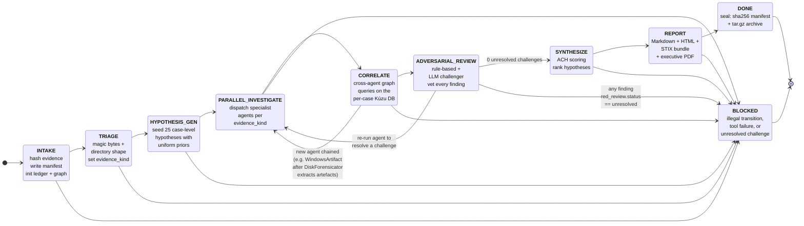

# EL coordinator — the state machine

EL's coordinator (`el/orchestrator/coordinator.py`) drives every
investigation through a fixed, finite state machine. The machine is
defined in **34 lines** at [`el/orchestrator/states.py`](../el/orchestrator/states.py)
— that brevity is intentional. Forensic chain of custody requires the
order-of-operations to be auditable; a small enum + a transition table
is easier to verify than a sprawling controller.

This page explains: what each state does, what triggers a transition,
why illegal transitions are refused, and how the machine guarantees no
report is rendered while any finding is still under adversarial dispute.

---

## At a glance



---

## State reference

| # | State | What runs | Required output to advance |
|---|---|---|---|
| 1 | **`INTAKE`** | Hash the evidence (sha256 + sha1 + md5), write per-case `manifest.json`, create the per-case workspace (`cases/<id>/{analysis,exports,reports,raw}/`), init the SQLite findings ledger and Kùzu graph DB. Evidence under `/cases/`, `/mnt/`, `/media/`, or any `evidence/` parent is automatically write-stripped. | A non-empty manifest with `input_sha256` set. |
| 2 | **`TRIAGE`** | The `TriageAgent` inspects magic bytes for files and directory shape for dirs. Sets `ctx.shared["evidence_kind"]` to one of: `pcap (libpcap)` / `pcapng` / `EWF (E01)` / `vhdx` / `vmdk (sparse)` / `EVTX (Windows Event Log)` / `windows-artifacts-dir` / `kape-triage` / `velociraptor-collection` / `android-fs-dir` / `android-archive` / `android-mtd-bundle` / `ios-fs-dir` / `itunes-backup` / `ios-sysdiagnose` / `linux-fs-dir` / `qnap-nas-dir` / `macos-fs-dir` / `bulk-extractor-output` / `k8s-audit-log` / `live-linux-system` / `uac-collection` / `dftimewolf-bundle` / `falco-events` / `cylr-collection-{windows,linux,macos}` / `log-corpus` (multi-host SOC log directory). This is the curated headline set; `KIND_TO_AGENT` in `coordinator.py` is the source of truth (38 distinct kinds incl. aliases). | A non-null `evidence_kind` value. |
| 3 | **`HYPOTHESIS_GEN`** | Materialise the 33 case-level hypotheses from `el/intel/hypotheses.py` with uniform priors. The leading hypothesis emerges from agent findings, not from this seed. | The hypothesis list is written to the ledger. |
| 4 | **`PARALLEL_INVESTIGATE`** | Dispatch agents per `KIND_TO_AGENT[evidence_kind]`. Some kinds chain: `DiskForensicator → WindowsArtifactAgent`, `MemoryForensicator → UserActivityAgent → RDPBruteForceAnalyst → MalwareTriageAgent`. Each agent emits Findings into the ledger. | At least one Finding emitted (or an `insufficient` Finding documenting the gap). |
| 5 | **`CORRELATE`** | Cross-agent overlap queries on the Kùzu graph (entities seen by ≥2 agents, shared IOCs, host↔account links). Layer-3 (cross-case) IOC lookups also run here, producing **low**-confidence context-only findings — they do not score hypotheses. | Correlation queries executed (may emit zero findings legitimately). |
| 6 | **`ADVERSARIAL_REVIEW`** | The `RedReviewerAgent` runs two challengers: (a) **rule-based** — always on, no external dependencies; checks each Finding against a baseline of "what could falsify this claim". (b) **LLM challenger** — runs only if `ANTHROPIC_API_KEY` is set. Each Finding's `red_review.status` is set to `passed`, `challenged`, or `unresolved`. | **Zero findings at `unresolved`.** If any remain unresolved the machine goes to `BLOCKED` — `SYNTHESIZE` is refused. |
| 7 | **`SYNTHESIZE`** | Heuer-style Analysis of Competing Hypotheses (ACH) scoring on the per-finding `ach_score_delta` field. Insufficient findings score nothing by contract. The ranking + score gap is written to `ach_matrix.json`. | The leading hypothesis and its score are recorded. |
| 8 | **`REPORT`** | Render `reports/report.md` (Markdown), `reports/case.html` (interactive HTML), `reports/executive.html` + `reports/executive.pdf` (six-section AI brief if `ANTHROPIC_API_KEY` is set, otherwise deterministic digest), and `reports/stix-bundle.json` (STIX 2.1 IOCs + ATT&CK). | All four report files exist. |
| 9 | **`DONE`** | Per-case **Layer 2 seal**: compute a sha256 manifest over every file in `cases/<id>/`, write `seal.json`, archive the case dir to `cases/_archives/<id>-<TS>.tar.gz`. The seal is what `el seal-verify` checks against weeks or months later. | Seal artefacts written; the case dir is immutable from here on. |
| — | **`BLOCKED`** | Terminal failure state. The audit log records why. Reachable from any state; no exit. | (none — `el seal-verify` and `el ledger` still work on a blocked case for post-mortem) |

---

## Transition table (authoritative)

The full table is in [`el/orchestrator/states.py`](../el/orchestrator/states.py).
Calling `coordinator._go(dst)` from a state that does not list `dst`
as a legal successor **raises** — there is no silent fallback. This is
load-bearing for chain of custody: an unexpected state change means the
controller is broken, not that we should plough on.

| From | Allowed to | Note |
|---|---|---|
| `INTAKE` | `TRIAGE`, `BLOCKED` | |
| `TRIAGE` | `HYPOTHESIS_GEN`, `BLOCKED` | |
| `HYPOTHESIS_GEN` | `PARALLEL_INVESTIGATE`, `BLOCKED` | |
| `PARALLEL_INVESTIGATE` | `CORRELATE`, `BLOCKED` | |
| `CORRELATE` | `ADVERSARIAL_REVIEW`, `PARALLEL_INVESTIGATE`, `BLOCKED` | back-edge to `PARALLEL_INVESTIGATE` lets a chained agent (e.g. `WindowsArtifactAgent` after `DiskForensicator` extracts artefacts) run before correlation closes |
| `ADVERSARIAL_REVIEW` | `SYNTHESIZE`, `PARALLEL_INVESTIGATE`, `BLOCKED` | re-runs an agent if the challenger demands it; refuses `SYNTHESIZE` while any Finding's `red_review.status == "unresolved"` |
| `SYNTHESIZE` | `REPORT`, `BLOCKED` | |
| `REPORT` | `DONE`, `BLOCKED` | |
| `DONE` | (none) | terminal — seal applied |
| `BLOCKED` | (none) | terminal — investigation incomplete |

---

## Why these specific states

Each state encodes a guarantee the next phase relies on:

- **Why `TRIAGE` is its own state, not folded into `INTAKE`.** Intake's job is to write the manifest *atomically* — no agents run, no `ctx.shared` keys are set. Triage then reads the now-immutable manifest and chooses the routing. Separating them makes "did we hash the input?" verifiable independent of "did we pick the right agent?".
- **Why `HYPOTHESIS_GEN` runs before agents.** The 25 case-level hypotheses are seeded with uniform priors so the ledger has a target schema for ACH score deltas the moment the first agent finishes. Without the seed, an agent would have nowhere to write `ach_score_delta`.
- **Why `CORRELATE` can loop back to `PARALLEL_INVESTIGATE`.** `DiskForensicator` extracts artefacts that only become parseable *after* the disk is mounted; `WindowsArtifactAgent` then needs to run against the extracted dir. The back-edge lets that chain happen without inventing a separate state for every chained pair.
- **Why `ADVERSARIAL_REVIEW` can also loop back.** If the LLM challenger has a substantive counter to a Finding — e.g., "you claim brute-force based on 3 failed logons, but the source IP is on the allow-list" — the right response is to re-run the affected agent with the new constraint, not to overwrite the Finding's confidence. The loop preserves the original Finding's audit trail.
- **Why `SYNTHESIZE` refuses to run with unresolved challenges.** ACH ranking weights confidence; a `red_review.status == "unresolved"` Finding has untrustworthy confidence by definition. Scoring with it would launder a dispute into a number. So the gate.
- **Why `DONE` is terminal and seals.** Once the case is sealed, any later read of `cases/<id>/` is verifiable against the seal manifest. Re-running `el investigate` on the same case-id creates a *new* timestamped seal rather than mutating the old one. This is the chain-of-custody property the report relies on.

---

## Reading a case's actual transitions

Every transition is recorded in two places:

| File | Format | What it shows |
|---|---|---|
| `cases/<id>/transitions.json` | JSON array | Ordered list of `{from, to, utc}` records — the state-machine trace |
| `cases/<id>/analysis/forensic_audit.log` | append-only log | Every state transition + every agent run + every tool invocation, with UTC timestamps |

Inspect with:

```bash
jq '.[]' /opt/EL/cases/<id>/transitions.json
tail -f /opt/EL/cases/<id>/analysis/forensic_audit.log
```

If a case ended in `BLOCKED`, the audit log's last `state_transition`
entry has the reason in its event payload — start there.

---

## Adding a new state

Don't. The machine intentionally resists growth because each state is a
load-bearing chain-of-custody checkpoint. If you find yourself wanting
a new state, the answer is almost always one of:

1. **A new agent inside `PARALLEL_INVESTIGATE`** — wire it into
   `KIND_TO_AGENT` in `coordinator.py`.
2. **A new sub-step inside an existing state** — call it as a private
   method on the coordinator; the audit log will record it as a
   sub-event of the parent state.
3. **A new artefact emitted at `DONE`** — extend the seal pass.

If after that the new state is genuinely required, update
**both** `State` enum and `TRANSITIONS` in `el/orchestrator/states.py`,
add a test in `tests/test_coordinator_blocks.py` proving illegal
transitions are still refused, and document the new state in this file
before the change merges. The test suite enforces that every member of
`State` appears in `TRANSITIONS` as a key.
